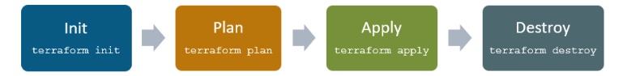
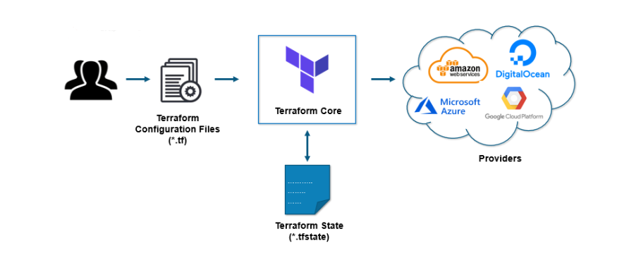
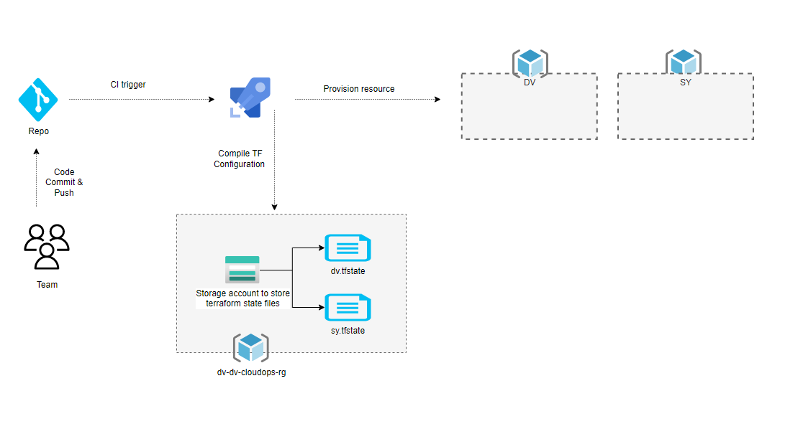

# Introduction 

Terraform is an open-source infrastructure as Code tool developed by HashiCorp. It is used to define and provision the complete infrastructure using an easy-to-learn declarative language.

#### Below are some of the benefits of using Terraform.

1. Does orchestration, not just configuration management
2. Supports multiple providers such as AWS, Azure, GCP, DigitalOcean and many more
3. Provide immutable infrastructure where configuration changes smoothly
4. Uses easy to understand language, HCL (HashiCorp configuration language)
5. Easily portable to any other provider
6. Supports Client only architecture, so no need for additional configuration management on a server

### Terraform Core concepts
Below are the core concepts/terminologies used in Terraform:

-  Variables: Also used as input-variables, it is key-value pair used by Terraform modules to allow customization.
- Provider: It is a plugin to interact with APIs of service and access its related resources.
- Module: It is a folder with Terraform templates where all the configurations are defined
- State: It consists of cached information about the infrastructure managed by Terraform and the related configurations.
-  Resources: It refers to a block of one or more infrastructure objects (compute instances, virtual networks, etc.), which are used in configuring and managing the infrastructure.
- Data Source: It is implemented by providers to return information on external objects to terraform.
- Output Values: These are return values of a terraform module that can be used by other configurations.
- Plan: It is one of the stages where it determines what needs to be created, updated, or destroyed to move from real/current state of the infrastructure to the desired state.
- Apply: It is one of the stages where it applies the changes real/current state of the infrastructure in order to move to the desired state.

### Terraform Lifecycle
Terraform lifecycle consists of – init, plan, apply, and destroy.

- Terraform init initializes the working directory which consists of all the configuration files
- Terraform plan is used to create an execution plan to reach a desired state of the infrastructure. Changes in the configuration files are done in order to achieve the desired state.
- Terraform apply then makes the changes in the infrastructure as defined in the plan, and the infrastructure comes to the desired state.
- Terraform destroy is used to delete all the old infrastructure resources, which are marked tainted after the apply phase.

### How Terraform Works?

### What is Terraform state? 
Terraform state is the mapping of your desired configuration to deployed resources. It answers the question, “What did I say should be deployed?” and how that differs from “What is actually deployed?”

By default, Terraform stores your state in a terraform.tfstate on the local machine.

This terraform.tfstate file allows Terraform to detect discrepancies between your configuration and deployed resources. For example, if a change was made to your provisioned resources through a GUI but was not defined in the infrastructure code, Terraform knows the difference because of the state file.

### Types of Terraform state store
There are two types of store for Terraform state: local and remote.

Local state refers to Terraform state stored on the local filesystem, i.e. on your laptop or whatever system you are running the terraform command from.
Remote state is Terraform state stored remotely, such as in an storage account or a database like PostgreSQL.
A remote backend is remote state that can be shared, providing helpful capabilities such as preventing conflicts and inconsistencies.

### Benefits of using Terraform Remote State
- Shared Storage: Remote state (Backend) allow each of your team members to access same Terraform state files to manage    infrastructure.
- Locking: With fully-featured remote backends, Terraform can lock the state file while changes are being made. This ensures all changes are captured, even if concurrent changes are being attempted against the same state. 
Without locking, if two team members are running Terraform at the same time, you may run into race conditions as multiple Terraform processes make concurrent updates to the state files, leading to conflicts, data loss, and state file corruption.
- Versioning: Some backends support versioning. This maintains versions of your Terraform state files allowing you to download an old version if needed. Likewise, it provides audit logs to know who changed what and when.
- Encryption: Many backends support encryption of the state file both in transit and at rest.
- Security: A local state file save the content in plain text. It is very common to have secrets or sensitive data in the state, so local state files are insecure. Remote state resolves this issue.
- Less Manual Errors: Using a local state file as a shared storage, manually sync the changes could cause someone forget to sync the state file. Remote state will always sync the state automatically whenever it change.
There are less changes of accidentally deletion of state file when it is stored remotely than on the local machine.

## Hands On for Creating a App Registration.
- To Register an app you will need to elevate as cloud application admin or developer before running the script.
### prerequisites
- Install Terraform https://www.terraform.io/downloads on your local and add path to environment variables.
- Skip this if azure cli is already installed on your PC - https://learn.microsoft.com/en-us/cli/azure/install-azure-cli-windows?tabs=azure-cli

1. Run "az login" for Azure AD authentication 
2. Open Powershell and go to the path - /AppReg-Demo
3. Run terraform init (Initializes the Modules)
4. Update null Variable values in Env/dv.tfvars 
5. Run terraform plan -var-file="Env/dv.tfvars” 
6. Run terraform apply -var-file="Env/dv.tfvars” 
- Verify the Registered app
7. Run terraform destroy -var-file="Env/dv.tfvars”
